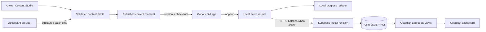

# MathLand Godot Redesign Design

**Status:** User-approved product design; awaiting written-spec review

**Date:** 2026-07-21

**Target repository:** `jinhoofkepco/Mathland_new2`

**Legacy reference:** `jinhoofkepco/SeoaQuiz` at `08b9e7589a335f0c5674cfac6743132f8c4870f2`

## 1. Objective

Rebuild the legacy native Android MathLand application as a new Godot game that prioritizes satisfying game feel, data-driven difficulty control, reusable visual math manipulatives, multiple child profiles, offline play, and remote guardian visibility.

The first release is a new installation with no legacy progress migration. It ships as a signed Android APK in a GitHub Release and includes a responsive guardian dashboard plus an owner-only Content Studio. A live Supabase project is connected only after the rest of the system is complete and testable against local contracts.

## 2. Why a new engine and codebase

The legacy app concentrates quiz parsing, question rendering, progression, effects, file persistence, and logging in Android activities. Its active product surface contains five math games, health, levels, apples, coupons, collectible pictures, review logs, and basic animation. Remote monitoring is limited to manual SMS composition and an unused sample upload method.

Godot is selected because the redesign requires layered effects, reusable manipulatives such as ten rods and number lines, tactile input feedback, animation, audio buses, scene composition, and additional game modes. The new codebase does not port the monolithic activities. It preserves the useful learning rules and content semantics behind small, independently testable modules.

## 3. Approved product decisions

| Area | Decision |
|---|---|
| Child platform | Android APK built with Godot 4.7.1 and GDScript |
| Package identity | `com.jinhoofkepco.mathland`, version `1.0.0`, version code `1` |
| Rendering | Godot Compatibility renderer for broad Android support |
| Screen | Phone portrait first; portrait tablet expansion must not require an architectural rewrite |
| Profiles | Multiple child profiles with separate progress, settings, and rewards |
| Connectivity | Offline-first; cloud availability never blocks play |
| Guardian access | Responsive web dashboard using email magic-link authentication |
| Backend | Supabase Auth, PostgreSQL, Row Level Security, Data API, and Edge Functions |
| Content scope | Five legacy activities plus a seven-year-old foundations pack |
| Difficulty | Data-driven; adaptive behavior is optional and off by default |
| Game rules | Health is lost on wrong answers; zero health ends the current run |
| Priority | Game feel, effects, button response, content adjustability, then instructional assistance |
| Visual direction | Warm “Math Exploration Island” with a sea-otter guide named Moa |
| Assets | New cohesive assets; no legacy raster assets are required in the release |
| Voice | Warm female guide; minimal inside questions and never interaction-blocking |
| Existing data | Start fresh; no migration of legacy levels, apples, coupons, or gallery records |
| Release | Source, documentation, signed APK, checksum, screenshots, and release notes on GitHub |

## 4. Scope boundaries

### Included in 1.0.0

- Profile creation, avatar selection, a four-digit local child PIN, and profile switching.
- Exploration Island home, stage map, daily challenges, free-play activity catalogue, inventory, collection book, and settings.
- Health, combo, timer, stage, boss-question, apple, collection, coupon, and island-restoration systems.
- Five migrated activities: addition, subtraction, multiplication, common multiples/LCM, and prime factorization.
- Foundations pack: counting, number bonds, ten frames, ten rods/base-ten blocks, number line, and basic addition/subtraction.
- Reusable manipulatives shared by multiple activities.
- Manual difficulty/content editing, validation, versioning, publishing, and rollback.
- Optional AI-assisted draft creation behind a provider adapter; manual editing remains fully functional without an AI key.
- Offline event journal, local progress snapshots, authenticated synchronization, and duplicate-safe ingestion.
- Guardian dashboard and owner-only Content Studio.
- New visual assets, motion, music, sound effects, and bundled Korean voice clips.
- Automated logic, content, scene, web, database policy, synchronization, and Android smoke tests.

### Explicitly excluded from 1.0.0

- iOS, desktop, or browser versions of the child game.
- Landscape-first layouts or a separate tablet-specific UI.
- Google Play Store submission; the delivery target is a GitHub Release APK.
- In-place update of `com.example.test3` or import of legacy private app data.
- Advertising, in-app purchases, loot boxes, public leaderboards, chat, or social features.
- Automatic publication of AI-generated content changes.
- Live remote control of a child’s current game session.
- Sending child learning logs to an AI provider by default.

## 5. Subproject decomposition

The product is intentionally split into four independently testable subprojects. Each receives a separate implementation plan while conforming to the shared contracts in this document.

| Subproject | Owns | Produces | Depends on |
|---|---|---|---|
| A. Godot Foundation and Game Core | Project shell, navigation, profiles, local storage, game state, effects, audio, reusable controls | A complete offline vertical slice | None |
| B. Content and Asset Pipeline | Content schemas, expression engine, generators, manipulatives, legacy conversion, new activities, art/audio pipeline | Validated versioned content packages and final assets | A’s interfaces |
| C. Cloud, Dashboard, and Content Studio | Supabase schema/RLS/functions, sync service, guardian web app, editor, AI adapter | Secure remote monitoring and content publication | A’s event contract and B’s content schema |
| D. Integration, Android, and Release | Cross-system E2E tests, performance, signing, documentation, APK and GitHub release | Verified production release | A, B, and C |

Subprojects may be implemented in this order, with contract stubs allowing A and B to proceed before live cloud credentials exist.

## 6. System architecture

### Godot module boundaries

- `AppRouter`: owns scene transitions and back navigation; it does not contain learning logic.
- `ProfileService`: owns local profiles, selected profile, settings, and local PIN verification.
- `ContentRepository`: validates cached packages, resolves the published version, and supplies immutable activity definitions.
- `QuestionEngine`: produces deterministic questions from an activity definition and seed.
- `ExpressionEngine`: evaluates the supported math grammar without arbitrary code execution.
- `RunController`: owns health, score, combo, stage goals, timers, pause, and run completion.
- `ProgressReducer`: derives local progress and rewards from append-only events.
- `EventJournal`: writes events before visual progression and returns them for synchronization.
- `SyncService`: authenticates, batches, retries, acknowledges, and compacts synchronized events.
- `AudioService`: owns the Master, Music, SFX, and Voice buses and voice interruption.
- `EffectsService`: plays named effect presets within quality and reduced-motion settings.
- `Manipulative` scenes: expose consistent reset, configure, interaction, and answer-state APIs.

No game scene may write files, call Supabase, parse raw content, or mutate global progress directly.

## 7. Child experience

The primary route is:

`Profile Select → Exploration Island → Daily Path or Free Play → Activity Run → Result/Reward → Island`

### Profile selection

- Each profile has a nickname, avatar, local PIN, settings, progress, and inventory.
- Real name and exact date of birth are not required.
- The PIN prevents accidental profile switching; it is not treated as server authentication. Store only a randomly salted verifier, rate-limit repeated failures, and never store or synchronize the plaintext PIN.
- Adaptive difficulty, timing aids, reduced motion, and audio levels are profile-specific.

### Exploration Island

- The home screen shows three daily objectives, continue, free play, apple balance, pending review, and sync state.
- Stage islands group activities by concept rather than mirroring file names.
- Moa introduces first-time concepts, reacts to runs, and anchors collection rewards.
- Cards and navigation have visible labels; the app never relies on icon-only meaning.

### Run loop

1. Load one immutable activity/content version for the entire run.
2. Show a skippable stage introduction.
3. Generate a deterministic question and optional manipulative state.
4. Accept direct manipulation or keypad/choice input.
5. Persist the answer event before advancing visual state.
6. Apply health, combo, score, reward, and effects.
7. Continue until the configured target is reached or health reaches zero.
8. Persist run completion, show results, and return to the island or restart.

The default run starts with three hearts. Heart count, target score, timer, rewards, and effect intensity are Content Studio fields. A wrong answer removes health; zero health ends the run. Earned progress and rewards are preserved. Restart is immediately available.

## 8. Game feel and accessibility

### Input response

- Touch-down begins visual compression, shadow reduction, haptic feedback, and a short sound without waiting for touch release.
- Touch release uses a spring response and either confirms or cancels based on pointer bounds.
- Visible/audio feedback begins within 100 milliseconds of accepted input.
- Correct, wrong, combo, boss, level-up, reward, and health-loss events have distinct effect presets.
- Long celebration and tutorial sequences are tappable to skip.

### Effects

- Effects use pooled particles and pooled transient nodes.
- Combo tiers progressively add border glow, particles, character reactions, and music layers.
- Wrong answers use a short shake and heart-break response; effects do not obscure the next input state.
- Quality levels reduce particle count, shader work, and background motion without changing rules.
- Reduced-motion mode removes screen shake and large translations while keeping clear state feedback.

### Accessibility

- Interactive targets are at least 48 density-independent pixels in the Android result.
- Correctness is communicated using shape, icon, text, and sound rather than color alone.
- Voice can be replayed, interrupted, or disabled independently of music and effects.
- Timers can be disabled by activity/profile setting when the activity permits it.
- Korean copy is centralized; no gameplay text is hard-coded into scenes.

## 9. Difficulty and content model

All instructional and game tuning is data, not conditional logic embedded in a scene.

### Activity package

Each published package contains:

- `schema_version`
- `content_version`
- `activity_id`
- localized title, description, and tutorial copy
- icon and scene references from an allowlist
- health, target, timer, reward, combo, and effect configuration
- ordered difficulty bands
- generator name and typed generator parameters
- answer layout and manipulative configuration
- optional adaptive-difficulty policy
- validation samples and package checksum

The app accepts only supported schema versions, known generator/manipulative names, valid resource paths, and a matching checksum.

### Difficulty behavior

- Adaptive difficulty is off by default and can be toggled per profile and activity.
- Fixed mode follows the published difficulty band and stage progression exactly.
- Adaptive mode may use recent correctness, response time, hints, and repeated errors to move only within the published minimum and maximum bands.
- Adaptation never changes game rules, rewards, or content version mid-run.
- Every generated question records its content version, generator ID, band, seed, and resolved parameters for reproduction.

### Expression grammar

The expression engine supports numeric literals, named components, parentheses, addition, subtraction, multiplication, division with explicit zero handling, modulo, quotient, digit extraction, GCD, and LCM. It does not evaluate GDScript, JavaScript, shell syntax, remote code, or unregistered functions.

### Content publication

- Editors work on immutable drafts.
- Validation produces representative questions for every difficulty band and independently verifies answers.
- Publishing creates a new immutable version and moves the manifest pointer atomically.
- A run already in progress finishes on its starting version.
- Rollback moves the manifest to a previously validated version; packages remain auditable.
- Devices retain the last valid package and apply a download only after schema and checksum validation.

## 10. Initial activity catalogue

### Migrated activities

- Addition, including ones-digit-focused game variants.
- Subtraction.
- Multiplication.
- Common multiples and LCM.
- Prime factorization.

The converter reads legacy CSV only during development. Runtime content is the new validated package format. Compatibility fixtures prove that representative legacy inputs produce the same answers in the new expression and generator engines.

### Seven-year-old foundations pack

- Counting and one-to-one correspondence.
- Number bonds: split and combine.
- Ten-frame recognition and completion.
- Ten rods/base-ten block construction and decomposition.
- Number-line movement.
- Basic addition and subtraction using manipulatives.

Reusable manipulative scenes include counters, ten frame, ten rod/base-ten block, number line, and answer slots. They expose configuration and state; activity rules remain in controllers and content definitions.

## 11. Local persistence and synchronization

### Files

- `user://profiles.json`: atomic profile index and non-sensitive profile settings.
- `user://profiles/<profile_id>/snapshot.json`: versioned derived progress snapshot.
- `user://profiles/<profile_id>/events.jsonl`: append-only learning event journal.
- `user://content/`: verified package cache and active manifest.
- Device refresh credentials are stored through a thin Android Keystore integration, not in these files.

Writes use a temporary file, flush, and atomic replacement where replacement semantics apply. Events are appended before the UI advances. An invalid last JSONL line is quarantined on startup while earlier valid events are replayed.

### Learning event contract

`LearningEventV1` contains:

- UUIDv4 `event_id`
- `profile_id`, `device_id`, and optional `session_id`
- monotonic local sequence number and client timestamp
- event type
- activity/content version, question seed, generator, band, and resolved parameters
- submitted answer, correct answer, correctness, response duration, hints, health delta, combo, and reward delta where applicable
- contract version

Events are immutable. Corrections are new events.

### Synchronization algorithm

- Send up to 100 unacknowledged events in sequence order.
- The server enforces a unique `event_id`, so retries are idempotent.
- The response returns accepted/already-present IDs and a server cursor.
- Retry network and server-unavailable failures with jittered exponential backoff from 2 seconds to 5 minutes.
- Do not retry authentication, schema, or permission errors until their cause changes.
- Compact acknowledged local events only after a fresh snapshot is flushed.
- Show the last successful sync time; never block a run on sync.

## 12. Supabase identity, schema, and security

### Identity

- Guardians use Supabase email magic-link authentication.
- Each app installation uses an anonymous Supabase Auth identity.
- A guardian creates a single-use, short-lived pairing code for one child profile.
- The pairing Edge Function binds the anonymous device user to that family/profile and consumes the code.
- Refresh credentials are protected by Android Keystore.

### Core tables

- `families`
- `family_memberships`
- `child_profiles`
- `devices`
- `pairing_codes`
- `learning_events`
- `progress_snapshots`
- `reward_inventory`
- `guardian_rewards`
- `content_drafts`
- `content_versions`
- `content_publications`
- `audit_log`

Aggregate SQL views supply dashboard summaries without exposing unrelated rows.

### Row Level Security

- A guardian can read and manage only families where membership is active.
- A device can insert events only for its paired child profile and cannot read guardian identity data.
- Content editors can mutate drafts but cannot bypass publication validation.
- Only an owner can publish or roll back content and configure the AI provider.
- Service-role credentials exist only in Edge Function secrets and deployment automation.
- Cross-family read, write, update, and deletion attempts are automated negative tests.

### Privacy

- Store nicknames and learning data required for the product; do not require real names, exact birth dates, location, contacts, camera, microphone, or advertising identifiers.
- Do not request broad external-storage permissions.
- Exclude credentials and learning logs from Android cloud backup and device transfer.
- Guardians can export family data, delete a profile, and disconnect a device.
- Detailed data remains until the guardian deletes the profile; deletion removes the profile’s cloud records and local reset removes cached data from that device.
- AI requests contain content rules and administrator instructions, not child event logs, unless a future separately approved feature explicitly changes this rule.

## 13. Guardian dashboard and Content Studio

The web application uses TypeScript, React, and Vite and is deployed as a static GitHub Pages application. Supabase Auth and RLS authorize browser requests. The publishable client key is configuration, while secret/service keys never enter the static bundle.

### Guardian dashboard

- Today, seven-day, and 30-day learning time and correctness.
- Per-child and family-level views.
- Progress by activity, repeated-error patterns, and optional adaptive changes.
- Recent sessions, health-depletion runs, combo records, and last synchronization.
- Apple, collection, coupon, and guardian-reward state.
- Reward definition, device disconnect, data export, and profile deletion actions.
- Clear stale/offline indication when a device has not synchronized.

### Content Studio

- Role-gated owner/editor routes in the same web application.
- Form/table editor plus advanced raw JSON editor.
- Generator-specific fields and reusable presets.
- Deterministic sample generation, ten-rod/manipulative preview, answer verification, and schema errors.
- Draft comparison, audit history, immediate or scheduled publication, and rollback.
- AI prompt input that returns a structured patch and human-readable diff.
- AI patches must pass the same schema, generator, answer, and sample checks as manual edits and require an owner publish action.

The AI adapter is optional. Its server-side interface accepts administrator text plus the selected content draft and returns a typed patch. If no provider credential exists, the UI explains that manual editing remains available and performs no external call.

## 14. Art, motion, and audio

### Art system

- Warm palette built around mint, sky, sand, coral, apple red, and gold.
- Moa, a sea-otter math explorer, is the primary guide.
- UI, buttons, icons, manipulatives, and scalable learning graphics use Godot styles and reviewed SVG assets.
- Character, island, background, and collection art use approved raster master sheets and transparent exports.
- The canonical design canvas is 1080×1920 portrait; layouts use anchors and containers rather than fixed pixel placement.
- New art follows a versioned character sheet, palette, outline, lighting, and expression guide.
- `ASSET_LICENSES.md` records whether each asset is original, generated, or third-party and its permitted use.

### Audio system

- Four buses: Master, Music, SFX, and Voice.
- Warm female voice is used for home, first-time tutorials, rewards, and level-up moments.
- Question narration plays only from a speaker control; no voice clip blocks input or progression.
- Voice clips use stable dialogue IDs so a complete voice set can be replaced without scene edits.
- System voices may be used for internal auditions. The distributable APK uses only voice output whose bundling and redistribution rights have been confirmed and documented before release.
- Exploration, concentration, and boss music are seamless loops; combo tiers add layers rather than restarting tracks.
- All required release audio is bundled for offline play.

### Asset generation policy

AI image generation may create raster concept and production candidates after the spec is approved. Code-native UI, SVG icons, and manipulatives are authored as project-native assets. Every generated asset is visually reviewed for character consistency, incorrect mathematical marks, unwanted text, artifacts, and safe transparency before inclusion.

## 15. Error handling

- Content loading failure: use the last verified package; if none exists, use the bundled release package.
- Corrupt local snapshot: replay the valid event journal; quarantine the corrupt file and show a recoverable diagnostic.
- Partial final journal record: ignore and quarantine only that record.
- Network timeout or server unavailable: continue offline and retry with backoff.
- Authentication expired: refresh once; if refresh fails, keep data queued and request re-pairing without deleting local progress.
- Permission or schema rejection: stop automatic retries for that batch, retain events, and surface a diagnostic code.
- Duplicate event: treat as acknowledged success.
- Content publication validation failure: keep the draft unpublished and display field/sample errors.
- AI provider failure: preserve the manual draft and allow manual editing; never publish partial AI output.
- Low-memory/effect overload: reduce the effect quality tier without changing gameplay state.
- Audio failure: continue with visual feedback and retain audio settings.
- Interrupted Android lifecycle: flush the current event and run state on pause, then resume without generating a duplicate question.

## 16. Test strategy

### Godot tests

- A repository-owned headless GDScript test runner avoids depending on a test plugin that is not yet released for Godot 4.7.1.
- Unit tests cover expression grammar, generators, fixed seeds, content validation, run state, health, combo, rewards, adaptive on/off, reducers, journal replay, and sync decisions.
- Scene tests instantiate buttons, manipulatives, and representative activities in a `SceneTree` and assert signals and visible state.
- Golden fixtures compare representative legacy CSV questions with converted package output.
- Property-style generation tests sample every difficulty band and independently verify answer validity and configured bounds.

### Web and database tests

- Vitest and React Testing Library cover dashboard reducers, formatters, permissions, and editor validation.
- Playwright covers guardian login stubs, child selection, dashboard filters, manual edit, validation failure, publish, rollback, and offline/stale states.
- SQL/pgTAP tests cover constraints, ingestion idempotency, aggregate views, deletion, and every RLS role boundary.
- Edge Function contract tests cover pairing, ingestion, content publication, and AI adapter errors.

### Android and end-to-end tests

- Install, launch, navigation, input, background/foreground, offline restart, and upgrade-over-same-version debug flows on an Android emulator.
- Exercise a complete run offline, reconnect, synchronize, and confirm the guardian dashboard aggregate.
- Verify the release APK signature and SHA-256 checksum.
- Inspect the APK and web bundle for service-role keys, signing files, personal data, sample domains, and development URLs.

## 17. Performance and quality gates

- Input feedback begins within 100 ms.
- The reference performance profile is a Pixel 6-class Android API 35 ARM64 device/emulator at 1080×2400 with 4 GB RAM.
- Target 60 frames per second during normal play on the reference profile.
- Effect-heavy scenes maintain a 95th-percentile frame time below 25 ms after warm-up; lower quality tiers must preserve rules and legibility.
- Cold launch reaches profile selection within 5 seconds on the reference profile.
- The release APK target is at most 200 MB; a larger APK blocks release until assets are profiled and an explicit exception is recorded.
- Core flows render without clipped controls at 360×800 phone portrait, 1080×2400 reference portrait, and 800×1280 tablet portrait viewports.
- The app remains fully usable with no network from first post-install launch through completed activities and rewards.
- All automated test suites pass with no ignored security or content-validation failures.

## 18. Build, signing, and release

- Godot 4.7.1, OpenJDK 17, Android platform 35, and build-tools 35.0.1 are the initial Android toolchain.
- Android minimum SDK is 24 and target SDK is 35.
- The `v1.0.0` release APK uses the Compatibility renderer and ARM64. Other ABIs are outside the first release and may be added by a later release.
- A new signing keystore is generated outside the repository. Its password is stored in macOS Keychain and its certificate fingerprint is documented without exposing the secret.
- No keystore, signing password, Supabase secret key, or AI key is committed.
- CI runs tests and produces unsigned/debug artifacts before secrets exist. Signed release automation activates only after repository secrets are configured.

The GitHub Release for `v1.0.0` contains:

- signed APK
- SHA-256 checksum
- release notes and known limitations
- installation instructions
- representative screenshots
- source tag
- asset/license record

The repository contains source, test suites, content sources, conversion and validation tools, Supabase migrations and functions, dashboard and Content Studio source, setup/operations documentation, and recovery/rollback procedures.

## 19. Credential and deployment gate

The local environment currently has GitHub authentication but no Supabase CLI authentication or Docker runtime. This does not block Godot, content, dashboard, schema, function, or contract-test development.

Implementation proceeds against version-controlled schemas and deterministic service fakes. Near final integration, one authorized Supabase project is required. The user does not send passwords or tokens in chat. Authorization happens through a trusted browser/CLI flow. Once authorized, the implementation deploys migrations, RLS, functions, and static configuration, then executes the live end-to-end test before claiming remote monitoring complete.

If live Supabase authorization is unavailable at that gate, the product is not declared fully complete and no claim is made that remote monitoring works. All other verified deliverables remain available while waiting for authorization.

## 20. Implementation sequence

1. Establish repository policy, project shell, headless tests, and CI.
2. Deliver the offline vertical slice: profile → island → ten-rod run → health/effects → reward → persistence.
3. Complete game core, content schema, expression engine, generators, and manipulative interfaces.
4. Convert and verify the five legacy activities.
5. Build the foundations pack.
6. Build sync contracts, Supabase schema/RLS/functions, guardian dashboard, and Content Studio against fakes and SQL tests.
7. Produce and integrate final art, motion, music, SFX, and approved voice assets.
8. Connect the authorized Supabase project and pass live synchronization/security tests.
9. Complete Android performance, lifecycle, accessibility, and device validation.
10. Sign, checksum, tag, publish the APK, and verify the GitHub Release download.

Every subproject ends in a running, independently testable deliverable. Detailed implementation plans split these steps further and use test-first changes with frequent intentional commits.

## 21. Product acceptance criteria

The redesign is complete only when all of the following are true:

- A fresh install supports multiple isolated child profiles.
- The entire child experience and every included activity work offline.
- The five legacy topics and the foundations pack are playable through data-driven definitions.
- Wrong answers reduce health and zero health ends a run without losing already persisted rewards.
- Adaptive difficulty can be enabled or disabled and fixed mode follows published settings exactly.
- Buttons, correct/wrong feedback, combo, level-up, health loss, and rewards meet the response and performance gates.
- Question narration is optional and all automatic voice/animation sequences are immediately skippable.
- Content Studio can validate, preview, publish, and roll back difficulty changes without a code change.
- AI can create a reviewable structured draft only when a provider is configured; it cannot auto-publish.
- Offline events survive force-stop and synchronize exactly once after reconnecting.
- RLS tests deny cross-family access and no privileged secret is present in clients or repository history.
- A real child-app event appears in the authorized guardian dashboard during the final live test.
- A signed, installable `v1.0.0` APK and checksum are downloadable from `jinhoofkepco/Mathland_new2`.
